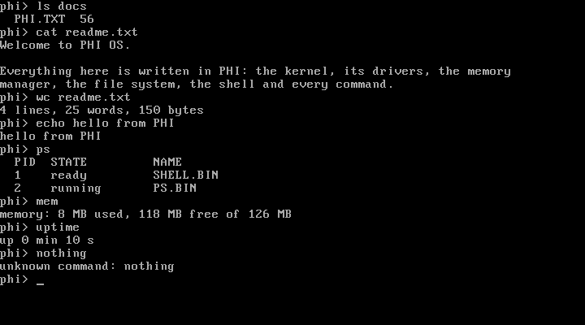

# PHI documentation

PHI is a programming language for writing operating systems. Instead of compiling to an
app that runs on Windows or Linux, a PHI program compiles to a disk image that a computer
boots from directly. The language and its standard library supply what an operating system
needs: booting, drivers, interrupts, memory management, files, and running programs.

Everything here runs in [QEMU](https://www.qemu.org/), an emulator, so you can experiment
without a spare computer and without any risk to your own.

## Learn PHI

Start with **[Getting started](getting-started.md)** to install the tools and boot your
first program. Then work through the tutorial. Each part builds a small, complete program
you can run, and explains what is happening underneath.

| # | Tutorial | You'll learn |
|---|---|---|
| 1 | [Your first boot sector](tutorial/01-boot-sector.md) | how a computer starts, `log` and `ask`, building and running |
| 2 | [Language basics](tutorial/02-language-basics.md) | variables, conditions, loops, arrays, strings, methods |
| 3 | [A 32-bit kernel](tutorial/03-kernel.md) | protected mode, drivers, pointers to video memory |
| 4 | [Interrupts and events](tutorial/04-interrupts.md) | the timer and keyboard, the panic screen, writing a driver |
| 5 | [Memory](tutorial/05-memory.md) | structs, pointers, `new` and `free`, paging |
| 6 | [Files on disk](tutorial/06-files.md) | the FAT16 disk, reading and writing files |
| 7 | [Programs and processes](tutorial/07-programs.md) | user programs, system calls, multitasking |
| 8 | [Add a command to PHI OS](tutorial/08-shell-command.md) | how the shell runs programs, writing `wc` |

The finished code for every part is in [examples/](examples), and it is tested: `phi test
docs/examples` boots each one and checks its output.

## Reference

- **[Language reference](language.md):** every statement, type, operator and built-in function
- **[Memory map and boot process](memory-map.md):** where everything lives in memory, and what
  happens between power-on and your code
- **[Architecture](architecture.md):** how the compiler, the standard library and the build fit
  together, for anyone changing PHI itself
- **[Plan](../Plan.md):** the roadmap, what each phase added, and what comes next

## Programs to read

| Program | What it shows |
|---|---|
| [samples/os.phi](../samples/os.phi) and [samples/os.rootfs](../samples/os.rootfs) | PHI OS: a kernel that boots into a shell, and the shell, commands and Pong as user programs |
| [samples/terminal.phi](../samples/terminal.phi) | a single kernel with a command line, a clock and a file viewer |
| [samples/kernel.phi](../samples/kernel.phi) | a small 32-bit kernel that prints the memory map |
| [samples/arcade.phi](../samples/arcade.phi) | Pong as a 16-bit program in graphics mode |
| [lib/phi](../lib/phi) | the standard library, in PHI: drivers, memory, the file system, processes |

## Contributing

See [CONTRIBUTING.md](../CONTRIBUTING.md).
