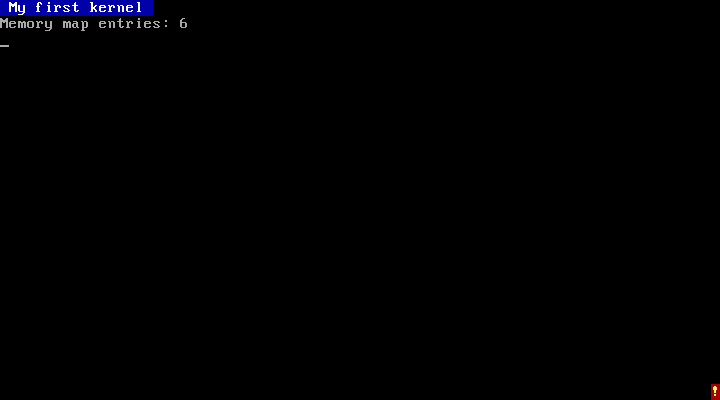

# 3. A 32-bit kernel

The boot sector in part 1 ran in **16-bit real mode**, the mode every PC still starts in
for compatibility with 1981. It can only reach about 1 MB of memory and has no protection.
Real operating systems switch the CPU to **32-bit protected mode** almost immediately.

In PHI, you get that by giving your class the base `Kernel`:

```phi
phi.MyKernel:Kernel
{
	...
}
```

PHI then builds the disk with two extra pieces in front of your code: a boot sector and a
small **loader**. The loader, still in 16-bit mode, loads your kernel from the disk, asks
the BIOS for a map of the memory, enables addresses above 1 MB, and switches the CPU to
protected mode. Then it jumps to your kernel at address `0x10000`.
[memory-map.md](../memory-map.md) has the details.

The catch: **in protected mode the BIOS is gone.** Nothing will print a character or read a
key for you any more; your kernel talks to the hardware directly. PHI's standard library
does that for the basics, so `log` still works (it writes straight to video memory), and
drivers like the one below do the rest.

## The program

[examples/03-kernel.phi](../examples/03-kernel.phi):

```phi
use drivers.vga_text;
use boot.info;

phi.MyKernel:Kernel
{
	call Vga.Clear;
	call Vga.SetColor: Colors.White Colors.Blue;
	call Vga.Print: ' My first kernel \n';
	call Vga.SetColor: Colors.LightGray Colors.Black;

	# what the loader found out about the machine
	ptr<BootInfo> boot: Boot.info;
	call Vga.Print: 'Memory map entries: ';
	call Vga.PrintNumber: boot:0.region_count;
	call Vga.Print: '\n';

	# straight to video memory, without the driver
	ptr<u16> screen: 0xB8000;
	screen:(24 * 80 + 79) is 0x4E21;    # a yellow-on-red ! in the bottom right corner

	debug 'kernel is running\n';
}
```

```
phi run docs/examples/03-kernel.phi
```



## What's going on

**`use drivers.vga_text;`** loads another PHI file, here
[lib/phi/drivers/vga_text.phi](../../lib/phi/drivers/vga_text.phi) from the standard
library. Open it: it's a complete text-screen driver, about 100 lines of PHI, with no
assembly. It defines a class `Vga` whose methods you call as `Vga.Clear`, `Vga.Print` and so
on.

**The text screen is memory.** In text mode, the graphics card shows whatever is at address
`0xB8000`: 80 x 25 cells of two bytes each, a character and a color. Writing to that memory
*is* drawing on the screen.

**`ptr<u16> screen: 0xB8000;`** is a **pointer**: a variable holding an address, here of
16-bit values. `screen:i` reads or writes the `i`th value at that address, just like an
array. Cell `24 * 80 + 79` is row 24, column 79, the bottom-right corner. `0x4E21` is the
character `0x21` (`!`) with color `0x4E` (yellow on red).

**`use boot.info;`** gives you the loader's notes about the machine, as a struct
(`BootInfo`) at a fixed address. `boot:0.region_count` reads a field through a pointer.

## Drivers are just PHI

A driver is code that knows how to talk to a piece of hardware. Besides memory, hardware
has **I/O ports**: numbered addresses you read with `in` and write with `out`. Here is how
the VGA driver moves the blinking cursor, by telling the graphics card's CRT controller
(ports `0x3D4` and `0x3D5`) the cursor's position:

```phi
[MoveCursor]
	u16 position: vga_row * VGA_WIDTH + vga_column;
	out VGA_CRTC_INDEX 0x0F;
	out VGA_CRTC_DATA position & 0xFF;
	out VGA_CRTC_INDEX 0x0E;
	out VGA_CRTC_DATA position >> 8;
[end]
```

`VGA_CRTC_INDEX` and friends are **constants**: `const u16 VGA_CRTC_INDEX: 0x3D4;`. They
take no memory and make port numbers readable.

## Try this

1. Draw a border around the screen by writing cells along all four edges.
2. Print every color: loop `c` from 0 to 15 and call `Vga.SetColor: c 0` before printing.
3. Print each entry of the memory map. The regions are an array of `MemoryRegion` structs
   at `boot:0.regions`; [samples/kernel.phi](../../samples/kernel.phi) shows how.

Next: [4. Interrupts and events](04-interrupts.md)
