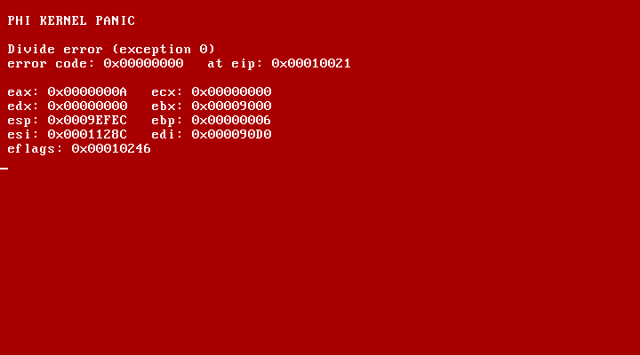

# 4. Interrupts and events

So far your code runs from top to bottom and stops. But hardware doesn't wait: a key gets
pressed whenever the user feels like it. Hardware gets the CPU's attention with an
**interrupt**: the CPU stops what it's doing, runs a handler, and then carries on as if
nothing happened.

PHI kernels start with interrupts set up: an interrupt table, and the PC's interrupt
controller configured so each device's interrupt (its *IRQ*) arrives at a known place. You
choose what to listen to.

## Events

The simplest way is an **event**: a method with a special name that runs when something
happens. [examples/04-interrupts.phi](../examples/04-interrupts.phi):

```phi
phi.Events:Kernel
{
	int ticks: 0;
	int keys: 0;

	call OS.SetupInteruptTimer;
	call OS.SetupKeyboardInterupt;
	log 'Press keys; I will count them. Press q to stop.\n';

	[OS.TimerEvent]
		ticks++;
		if ticks % 60 is 0
			debug 'a second went by\n';
		;;
	[end]

	[OS.KeyboardEvent]
		int key: 0;
		bln down: false;
		call key is OS.GetKey;
		call down is OS.IsKeyDown: key;
		if down
			keys++;
			log 'key ' keys ': ' key '\n';
			if key is 'q'
				log 'done\n';
				exit 0;
			;;
		;;
	[end]
}
```

Run it and press some keys. Each one prints its character code, and your terminal shows "a
second went by" every second.

**The main code finishes almost immediately**, after printing the message. That's fine: the
kernel then waits, and the events keep running whenever the hardware interrupts.

**`OS.SetupInteruptTimer`** programs the PC's timer chip and turns on its interrupt;
`[OS.TimerEvent]` then runs 60 times a second. **`OS.SetupKeyboardInterupt`** turns on the
keyboard driver; `[OS.KeyboardEvent]` runs on every key press *and* release, which is why
the code checks `OS.IsKeyDown`.

**`exit 0;`** stops QEMU (when it was started by `phi run` or a test). On a real machine it
just halts.

> Events interrupt your other code at any moment, so keep them short.

## Other timer and keyboard functions

You don't always need events. `OS.Sleep: 500` waits half a second, `OS.GetTicks` gives the
milliseconds since the timer started, and `OS.ReadKey` waits for a key and returns it. `ask`
works in kernels too.

## When things go wrong: the panic screen

When your kernel does something the CPU refuses, like dividing by zero or reading through a
null pointer, the CPU raises an **exception**: an interrupt from the CPU itself. PHI shows
the **panic screen**:



It names the exception, shows its error code, the address of the instruction that failed
(`eip`) and every register, and stops. Look up the `eip` address in your build's
`kernel.asm` to find the line. Try it: add `int zero: 0; int x: 1 / zero;` to the program.

## Writing your own interrupt handler

Events cover the built-in drivers. For other hardware, give an ordinary method to an IRQ
with `OS.SetIrqHandler`. This listens to the keyboard (IRQ 1) directly and reads the raw
*scan code*, the number the keyboard sends for each key:

```phi
call OS.SetIrqHandler: 1 addr KeyPressed;

[KeyPressed]
	u8 scan: in 0x60;     # the keyboard controller's data port
	log 'scan code ' scan '\n';
[end]
```

`addr KeyPressed` is the method's address. PHI saves every register around the method and
tells the interrupt controller when it's done.

## A driver in PHI: the clock

Not all hardware interrupts. The PC's real-time clock is read through two ports: write a
register number to port `0x70`, read its value from `0x71`.
[lib/phi/drivers/rtc.phi](../../lib/phi/drivers/rtc.phi) is a complete driver for it:

```phi
[ReadRegister: u8 register: 0;]
	out CMOS_INDEX register;
[end: in CMOS_DATA]
```

and with `use drivers.rtc;` your kernel can do:

```phi
call Rtc.Read;
log Rtc.hour ':' Rtc.minute ':' Rtc.second '\n';
```

## Try this

1. Show a clock in the corner of the screen that updates every second, using
   `[OS.TimerEvent]` and `Rtc.Read`. ([samples/terminal.phi](../../samples/terminal.phi) does this.)
2. Make the `a` key print `A` and every other key print its character.
3. Trigger a different exception and see its name on the panic screen: an invalid
   instruction (`ud2` in an `asm.` block) or a breakpoint (`int3`).

Next: [5. Memory](05-memory.md)
